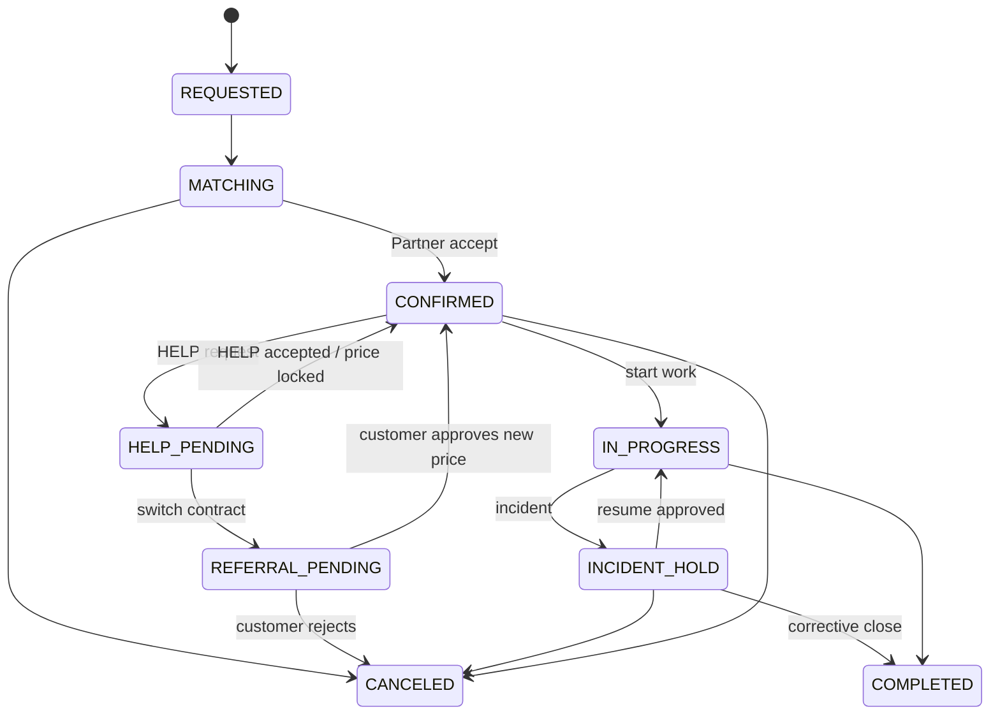

| 新/変更要件                    | 概要                      | 優先度 |
|--------------------------------|---------------------------|--------|
| F-033 Price Protection         | 予約確定時価格の保護      | P0     |
| F-034 HELP Payout              | 応援受託条件・精算        | P0     |
| F-035 Referral Repricing       | 完全紹介時の再提示・承認  | P0     |
| F-036 Margin Guard             | 赤字/低採算の自動成立防止 | P0     |
| F-037 Additional Work Approval | 追加作業の事前承認        | P0     |

## 注意・ガードレール

- 既存のorigin_partner / preferred_partner / service_partner分離方針を維持する。

- 業者間価格統一や価格共有のための機能は実装しない。

正式採用日：2026-09-16 / 本項はHOMENECT正式方針として運用・実装へ反映する。

# 26. Implementation Lock v2.3 Addendum

本章は、2026-09-16に正式採用された案件価格保護・応援施工制度と、実装着手前にロックした状態遷移・ERD・価格ロジック・例外権限をv2.3へ統合します。詳細は HOMENECT Implementation Lock Specification v1.0 を正とします。

## 26.1 Additional P0 Features

- F-033 Price Protection

- F-034 HELP Payout

- F-035 Referral Repricing

- F-036 Margin Guard

- F-037 Additional Work Approval

- F-038 Price Privacy

- F-039 Responsibility Snapshot

## 26.2 Reservation State Machine

| **State**        | **Meaning**    | **Allowed next**                        |
|------------------|----------------|-----------------------------------------|
| REQUESTED        | 依頼受付       | MATCHING / CANCELED                     |
| MATCHING         | 担当確認中     | CONFIRMED / CANCELED                    |
| CONFIRMED        | 予約確定       | HELP_PENDING / IN_PROGRESS / CANCELED   |
| HELP_PENDING     | 応援調整       | CONFIRMED / REFERRAL_PENDING / CANCELED |
| REFERRAL_PENDING | 完全紹介再承認 | CONFIRMED / CANCELED                    |
| IN_PROGRESS      | 施工中         | COMPLETED / INCIDENT_HOLD               |
| INCIDENT_HOLD    | 事故・例外停止 | IN_PROGRESS / COMPLETED / CANCELED      |
| COMPLETED        | 完了           | terminal                                |
| CANCELED         | 取消           | terminal                                |

## 26.3 Data Model Additions

- Reservation: handoff_type, customer_price_locked, contract_party, payee, service_partner_id, warranty_owner

- HelpRequest: support_payout, requester_partner_id, target_partner_id, terms_snapshot

- Referral: from_partner_id, to_partner_id, new_price_snapshot, customer_approved_at

- AdditionalWork: description, price, approved_at, approved_by

- AuditEvent: exception reason / before / after required for privileged actions

## 26.4 Price and Margin Logic

HELP: customer_price_locked remains unchanged. Referral: new price becomes effective only after explicit Customer approval.

margin = customer_price_locked - support_payout - platform_fee - variable_cost + support_subsidy

If margin \< minimum_margin, automatic HELP acceptance/assignment is prohibited. support_subsidy defaults to zero and requires authorized exception approval.

## 26.5 Admin Exception Permissions

| **Role**         | **Exception capability**            | **Mandatory guard**                  |
|------------------|-------------------------------------|--------------------------------------|
| Ops Admin        | HELP/Referral開始、許可済み状態遷移 | reason + AuditEvent                  |
| Finance Admin    | 精算・fee確認                       | finance scope only                   |
| Compliance Admin | case decision / staged action       | evidence + response + decision audit |
| Super Admin      | break-glass emergency               | MFA + reason + immutable audit       |

## 26.6 Additional APIs

- POST /api/reservations/{id}/help

- POST /api/help/{id}/accept

- POST /api/reservations/{id}/referral

- POST /api/referrals/{id}/approve

- POST /api/reservations/{id}/additional-work

- POST /api/additional-work/{id}/approve

- POST /api/admin/subsidies/{id}/approve

- POST /api/admin/reservations/{id}/transition

## 26.7 Additional Tests / Acceptance

TC-027〜TC-036 and AC-21〜AC-28 are P0. No P0 may be marked Complete without mapped evidence in Requirements Traceability v2.3.

## 26.8 Implementation Start Decision

P0 implementation may start immediately. Unknown business numeric values remain configurable and are not blockers. Legal review remains a Production Launch Gate, not a coding blocker, except where counsel identifies a required redesign.
